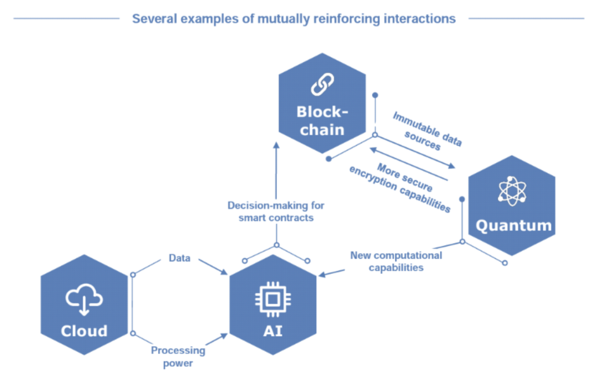
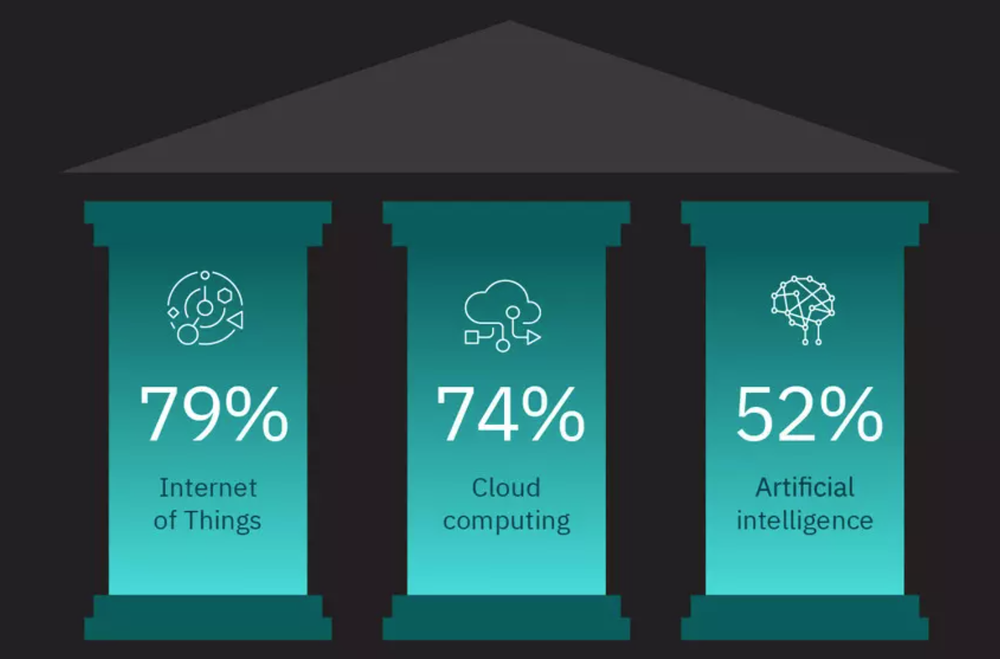

# Bootcamp 2021: Getting Developers Ready for the API Token Economy

## Fusing Serverless, Graph, AI, IoT, Blockchain, and Quantum Technologies

Covid-19 propelled businesses into the future, ready or not. “Covid has acted like a time machine: it brought 2030 to 2020,” said Loren Padelford, vice president at Shopify Inc. “All those trends, where organizations thought they had more time, got rapidly accelerated.” We at Panacloud are trying to respond to these challenges and trying to lead from the front.

This is a Open and Free Bootcamp, for admission just [fill this admission form](https://forms.gle/QFvfSMquJZftyyiT9).

Now start following the course material.

### The interplay between emerging and mature technologies: AI, blockchain and the cloud

[The interplay between emerging and mature technologies: AI, blockchain and the cloud](https://www.information-age.com/ai-blockchain-cloud-123482306/)

### The Technologies expected to Deliver Results over the Next Few Years

[The post-pandemic future of work - according to 3,000 CEOs from around the world](https://www.weforum.org/agenda/2021/02/the-post-pandemic-future-of-work-according-to-3-000-ceos-from-around-the-world-685436524a/)

### Graph-Based AI is the Future

[Graph-Based AI Enters the Enterprise Mainstream](https://www.informationweek.com/big-data/ai-machine-learning/graph-based-ai-enters-the-enterprise-mainstream/a/d-id/1340141)

### Bootcamp 2021 Coverage

Panacloud Bootcamp 2021 will fuse AI, IoT, Blockchain, and AWS Serverless Cloud Technologies. The Bootcamp will use Python, TypeScript and Rust as its development languages, TensorFlow as ML framework, AWS as its Serverless Cloud platform, AWS Graph Database Neptune, Ethereum as Blockchain platform and AWS Cloud Development Kit (CDK) with TypeScript for Infrastructure as Code.

### Those interested in web and mobile Serverless SaaS apps and APIs should also focus on [Bootcamp 2020](https://panacloud.github.io/bootcamp-2020/)

Difference Between Bootcamp 2020 and Bootcamp 2021

The objective of Bootcamp 2020 is to train developers to develop cloud based SaaS Apps and general serverless APIs for these apps. It includes developing graphic user interfaces (GUIs) development using React, Gatsby, and React Native.

[Bootcamp 2020](https://panacloud.github.io/bootcamp-2020/)

The objective of Bootcamp 2021 is to train developers to develop cloud based AI, IoT, Blockchain, and Quantum powered serverless APIs. We will not cover graphic user interfaces (GUIs) in Bootcamp 2021 but only voice based conversational interfaces. A conversational interface (CUI) is a user interface for computers that emulates a conversation with a real human. The course of this bootcamp is designed in such a way that Bootcamp 2020 is not a prerequisite to Bootcamp 2021.

[Bootcamp 2021](https://panacloud.github.io/bootcamp-2021/)

The recording of Bootcamp 2020 is now complete and in a few months recording of Bootcamp 2021 will start. When we say recording of Bootcamp 2020 is complete, it does not mean that the Bootcamp 2020 is closed. Admissions and project acceptance will remain open in both the Bootcamps at atleast till December 2023. We are also developing a platform for developers which will adopt both these bootcamps. Our upcoming Operation Unicorn Startups will also require participations in these bootcamps.

[Cloud’s trillion-dollar prize is up for grabs](https://www.mckinsey.com/business-functions/mckinsey-digital/our-insights/clouds-trillion-dollar-prize-is-up-for-grabs)

The objective of both Bootcamp 2020 and Bootcamp 2021 is to train people to go after this prize.

How many of these questions can you answer?

Note: Bootcamp 2020 and 2021 cover these topics.

Questions a Modern Application and API Developer must be able to answer:

1. What is Cloud Computing?
2. What is Serverless?
3. What is SaaS and Serverless SaaS?
4. What is Event-Driven Architecture?
5. What are APIs and what is the API Economy?
6. What are RESTful OpenAPIs?
7. What are GraphQL APIs?
8. What is IaC and Cloud Development Kit (CDK)?
9. What is Typescript and why do use it as our default web programming language?
10. What is Node.js?
11. What is Web Assembly?
12. What are Lambda Functions?
13. What are Containers?
14. What are Relational Databases and SQL? 
15. What is AWS Aurora Serverless?
16. What are Graph Databases and Gremlin?
17. What is AWS Neptune and Azure Cosmos DB?
18. Why do we now advise developers to use Relational or Graph Databases for developing their APIs?
19. What is an AWS Event Bridge?
20. What is real-time data streaming? e.g. Kinesis and Kafka
21. What is Edge Computing?
22. What is AWS Greengrass and Azure IoT Edge?
23. What is FreeRTOS?
24. What is Rust and what is it best used for?
25. What is AI as a Service (AIaaS)?
26. What is Tensorflow and why do we prefer Python for AI development?
27. What is Amazon SageMaker?
28. What is Amazon Neptune Machine Learning?
29. What is Amazon Aurora Machine Learning?
30. What are Smart Contracts?
31. What is Ethereum 2.0?
32. What is Ewasm?
33. What is Diem?
34. What is Quantum Computing?

### Operation Unicorn Startups

[Operation Unicorn Facebook Group](https://www.facebook.com/groups/operation.unicorn/)

Bootcamp 2021 is preparing developers for Operation Unicorn Startups. More details for Operation Unicorn Startups will be announced latter.

### Introduction to English and Urdu Sections

[Join Panacloud Bootcamp 2021 Discord Discussion Server Now](https://discord.gg/gEBtdDzHaN)

### English Section:

Every Saturday at 9:30 PM – 11:30 PM Pakistan Standard Time, First class on Saturday, June 12, 2021

You can participate in class by Joining Zoom Meeting, watch live on Facebook, or watch recording on YouTube.

Bootcamp 2021 (English) : Getting Developers Ready for the API Economy - Every Saturday 09:30 PM

Join Zoom Meeting

https://zoom.us/j/96221232702?pwd=ZmhxNUpXZ3dLdDc0anFYS2RTU09Qdz09

ZOOM Meeting ID: 962 2123 2702

ZOOM Passcode: 123456

It will be also live the following facebook group:

https://www.facebook.com/groups/deep.learning.edu

[English broadcast live on Facebook](https://www.facebook.com/groups/deep.learning.edu)

You can also see the recording on:

[English broadcast Recording on YouTube](https://www.youtube.com/watch?v=1ztdYFRyCyE&list=PLCD4H0tiu6FXq4fP5PmMu3vdGKN2kmqzp)

### Urdu Section:

Every Sunday 9:30 pm to 11:30 pm Pakistan Standard Time, First class on Sunday, June 12, 2021

You can participate in class by Joining Zoom Meeting, watch live on Facebook, or watch recording on YouTube.

Bootcamp 2021 (Urdu) : Getting Developers Ready for the API Economy - Every Sunday 09:30 PM

Join Zoom Meeting

https://zoom.us/j/93398753815?pwd=MzRVUUhQbzRiWHJ5UFpGY1BIeldzUT09 

ZOOM Meeting ID: 933 9875 3815

ZOOM Passcode: 123456

It will be also live the following facebook group:

[Urdu broadcast live on Facebook](https://www.facebook.com/groups/deep.learning.edu)

You can also see the recording on:

[Urdu broadcast Recording on YouTube](https://www.youtube.com/channel/UC3R9WHWHPPpy9B9ijA9pu3w)

### Teaching Team:

Inam ul Haq, Qasim, Anees, Faheem, Shahrukh, and Zia Khan.

## Prerequisites: TypeScript, Python, and Rust

### Learn TypeScript

[Essential TypeScript 4: From Beginner to Pro](https://www.dropbox.com/s/2j24mj3tl6wsy2m/Adam%20Freeman%20-%20Essential%20TypeScript%204_%20From%20Beginner%20to%20Pro.pdf?dl=0)

[Learn from our Repo](https://github.com/panacloud-modern-global-apps/learn-typescript)

### Learn Python

[Programming for Everybody (Getting Started with Python)](https://www.coursera.org/learn/python)

[The Official Python Tutorial](https://docs.python.org/3/tutorial/index.html)

[Python Full Course - Learn Python in 12 Hours - Python Tutorial For Beginners](https://www.youtube.com/watch?v=WGJJIrtnfpk)

[Python Tutorial - Python for Beginners 2020](https://www.youtube.com/watch?v=kqtD5dpn9C8)

[Python Tutorial For Beginners - Python Full Course From Scratch - Python Programming - Edureka](https://www.youtube.com/watch?v=vaysJAMDaZw)

### Learn Rust

[The Official Rust Book](https://doc.rust-lang.org/book/)

[Intro to Rust](https://www.youtube.com/playlist?list=PLJbE2Yu2zumDF6BX6_RdPisRVHgzV02NW)

[Rust Projects](https://www.youtube.com/playlist?list=PLJbE2Yu2zumDF6BX6_RdPisRVHgzV02NW)

[Learn Rust - Tutorials, Courses, and Books](https://gitconnected.com/learn/rust)

## Must Have: Create Free AWS Account

[AWS Free Tier](https://aws.amazon.com/free/)

Note: For AWS Free Tier you will need a credit or debit card. The easiest way for Pakistani students is to open a bank account in Meezan Bank. Open a Meezan Aasan Account if you have no earning proof. Meezan Bank will charge Rs. 1100 for ATM Debit Card and there is a requirement of Rs. 100 minimum deposit. The card will be delivered in a few weeks. Our students have reported that this Debit card works with AWS.

## Part 1: The API and Token Economy

### Class 1: Understanding the API Economy

The objective of Bootcamp 2021 is to prepare sofware developers for the API Economy (Application Programming Interface Economy). APIs are software interfaces that allow once separate software systems to seamlessly and easily talk to each other.  The innovative power of APIs has lead to the realization that software as a service (SaaS) applications can be built by combining APIs built by specialized API providers. That, in turn, has created the API Economy, which empowers developers to specialize and monetize their skills and domain knowledge.

A taxi booking SaaS app, for example, might combine a mapping SaaS API, communication SaaS API, and billing SaaS API, each from different providers, with their own UX layered on top. This makes it easy to launch new services without having to build everything from scratch. This makes it easier for all participants to develop unique products, services and functionality quickly and with less cost. 

In the API economy a developer may have different roles. It may be a SaaS developer or API provider. A API provider can also develop on top of other specialized APIs, thus creating layers of APIs. This creates an API economy where developers charge each other for the APIs built by them. The API provider charges others for using his APIs, and at the same time pays other providers to use their APIs. The SaaS app developers who uses all these APIs bills the end-customer for the service. This exchange of value is what makes an API economy.    

Ideally, the developer who uses SaaS APIs wants to be charged a usage based subscription fee, not a fixed monthly subscription. This usage based subscription fee has been made possible by serverless cloud technologies. Serverless is also being called Cloud 2.0.

The rise of of API Economy has created a new kind of software company i.e. an API-First Company. A company, which develops software not for the end-users as its main customer, but other developers who uses it as a component to build applications. The Panacloud platform provides the means by which developers and entrepreneurs can build their API-First Unicorn startups. 

The API Economy levels the playing field for everyone from the smallest developers to the largest companies. However, it also creates many challenges. First, often there is no direct contact between the API provider and the developer who utilizes it, it can be hard to know which API to build with what functionality. Second, it is difficult to know which APIs are available and which API to use and their comparative strengths and weaknesses. Third, most of the current SaaS applications and API are built using legacy Cloud 1.0 technologies, thus they don’t have usage based billing support and also some have scalability issues. Fourth, the APIs are centrally managed and multi-tenant by their very nature, making it difficult to manage, measure resource usage in a serverless environment, and bill the tenant. Fifth, each and every API provider has to build a custom platform to monitor and measure serverless resource usage and bill clearing functionality thus increasing the time-to-market. Sixth, there is an extreme shortage of serverless cloud developers thus making life every difficult for both API providers and SaaS app companies. Seventh, there is a scarcity of coherent and comprehensive training material for multi-tenant severless SaaS app and API developers.

Panacloud has started and is leading a social movement called Operation Unicorn to help anyone and everyone become a cloud developer, a startup founder, and participant in the API economy. The focus is on building API-First startups, which will in time become billion dollar companies. This movement is striving to build a community that will not only transform individuals, but societies and countries as well.

[API Economy Presentation for Class](https://docs.google.com/presentation/d/1rjiNSoQV87mgZNCCA5xf__B-OOTTuK7CCriwpesDR90/edit?usp=sharing)

Support Reading Material:

[API economy](https://searchapparchitecture.techtarget.com/definition/API-economy)

[What is the API Economy & why it matters to your business](https://www.torocloud.com/blog/what-is-the-API-economy-and-why-it-matters-to-your-business)

[How the API economy is powering digital transformation](https://venturebeat.com/2021/05/17/how-the-api-economy-is-powering-digital-transformation/)

[API Economy: Is It The Next Big Thing?](https://www.forbes.com/sites/tomtaulli/2020/01/18/api-economy--is-it-the-next-big-thing/)

[What Is The “API Economy” And How Brands Can Benefit From It](https://medium.com/ipg-media-lab/what-is-the-api-economy-and-how-brands-can-benefit-from-it-b46210d0434d)

[Welcome to the API Economy](https://www.gartner.com/smarterwithgartner/welcome-to-the-api-economy/)

[The State of the API Economy 2021](https://pages.apigee.com/rs/351-WXY-166/images/Apigee_StateOfAPIS_eBook_2020.pdf)

[Serverless Computing](https://www2.deloitte.com/content/dam/Deloitte/tr/Documents/technology-media-telecommunications/Serverless%20Computing.pdf)

[Reshaping the business landscape with serverless APIs](https://azure.microsoft.com/en-us/blog/reshaping-the-business-landscape-with-serverless-apis/)

[Serverless, Microservices & Other Trends in API and Services Architecture](https://www.moesif.com/blog/api-guide/the-next-api-platform-serverless-and-blockchain/)

[API Strategy Essentials](https://www.mulesoft.com/lp/whitepaper/api/api-strategy-essentials)

[5 Ways AI, IoT, and security are shaping the API economy](https://www.mulesoft.com/lp/ebook/api/artificial-intelligence-chatbot)

[The platform economy is an API economy. And artificial intelligence needs APIs](https://blogs.sas.com/content/hiddeninsights/2017/05/23/api-economy-and-artifical-intelligence/)

[The Pivotal Role of Business APIs in IoT Platforms: Part I](https://www.iotforall.com/business-api-iot-platforms)

[How important is the API economy to blockchain application development?](https://www.hebergementwebs.com/blockchain/how-important-is-the-api-economy-to-blockchain-application-development)

[APIs and Blockchain — a trillion-dollar opportunity](https://medium.com/monsterplay/apis-and-blockchain-a-trillion-dollar-opportunity-84ed839b313a)

[Architectural Style for APIs – how to make the choice](https://api-university.com/blog/architectural-style-for-apis/)

[Comparisons of API Architectural Styles](https://www.moesif.com/blog/api-guide/comparisons-of-api-architectural-styles/)

Class 1 Videos: The API Economy

[Class 1: What is the API Economy in English on YouTube](https://youtu.be/1ztdYFRyCyE)

[Class 1: What is the API Economy in English on Facebook](https://www.facebook.com/fb.anees.ahmed/videos/10159552963217376)

[Class 1: What is the API Economy in Urdu on YouTube](https://youtu.be/V4z6KC3ENmM)

[Class 1: What is the API Economy in Urdu on Facebook](https://www.facebook.com/Ai.SirQasim/videos/2257587044376073)

### Class 2: Programmable Money for the API Economy: Stable Coin DAI

[Presentation for Class 2](https://docs.google.com/presentation/d/1Tg6Y5aqqavTW5iQP6KfkXrUDSU0rTXvPQk3xNVmhEUo/edit?usp=sharing)

Reading Material:

[Charting the evolution of programmable money](https://www.ibm.com/thought-leadership/institute-business-value/report/programmoneyevo)

[What Actually is Programmable Money?](https://www.linkedin.com/pulse/what-actually-programmable-money-antony-lewis/)

[What Is MakerDAO’s DAI Stablecoin?](https://www.coinspeaker.com/guides/what-is-makerdaos-dai-stablecoin/)

[What is DAI, and how does it work?](https://medium.com/mycrypto/what-is-dai-and-how-does-it-work-742d09ba25d6)

[Top Use Cases and Benefits of Stablecoins](https://medium.com/stably-blog/top-use-cases-and-benefits-of-stablecoins-4f1ceab57d00)

[How To Use DAI Stablecoin: Beginner's Guide (2021)](https://decrypt.co/resources/dai-explained-guide-ethereum-stablecoin)

Class 2 Videos: Programmable Money

[Class 2: Programmable Money in English on YouTube](https://www.youtube.com/watch?v=-WQ2DHpeaFs)

[Class 2: Programmable Money in English on Facebook](https://www.facebook.com/fb.anees.ahmed/videos/10159569309457376)

[Class 2: Programmable Money in Urdu on YouTube](https://youtu.be/CJNtss-KKxI)

[Class 2: Programmable Money in Urdu on Facebook](https://www.facebook.com/Ai.SirQasim/videos/2263454747122636)

### Class 3: The Token Economy

[Presentation for Class 3](https://docs.google.com/presentation/d/1oHADvCVKBDfGBYRRTuyHHPspQjKLS5xHuy-lTLFMi4I/edit?usp=sharing)

Reading Material:

[What is Web 3.0?](https://medium.com/fabric-ventures/what-is-web-3-0-why-it-matters-934eb07f3d2b)

[What is Token Economy?](https://www.oreilly.com/library/view/what-is-the/9781492072973/ch01.html)

[Tokenomics](https://decrypt.co/resources/tokenomics)

[What is Tokenomics](https://www.upgrad.com/blog/what-is-tokenomics/)

[NFTs are the “big thing” in today’s crypto world. The future of the creative economy](https://www.addvante.com/en/nfts-are-the-big-thing-in-todays-crypto-world/)

[NFTs](https://www.bbc.com/news/technology-56371912)

[SFTs](https://www.globenewswire.com/fr/news-release/2021/04/29/2220057/0/en/Mocktail-Becomes-The-First-ERC-1155-Standard-Semi-Fungible-Token-SFT-Launched-on-Binance-Smart-Chain.html)

[ERC-1155](https://boxmining.com/erc-1155/)

[Token Economy Book](https://github.com/sherminvo/TokenEconomyBook)

Class 3 Videos: Token Economy

[Class 3: Token Economy in English on YouTube](https://www.youtube.com/watch?v=w7uvlzXTGBU&t=17s)

[Class 3: Token Economy in English on Facebook](https://www.facebook.com/fb.anees.ahmed/videos/4452119318173275)

[Class 3: Token Economy in Urdu on YouTube](https://youtu.be/KxCkksNtiT0)

[Class 3: Token Economy in Urdu on Facebook](https://www.facebook.com/Ai.SirQasim/videos/2269720149829429)

## Part 2: Fast Track Review of TypeScript

[Essential TypeScript 4: From Beginner to Pro: Chapter 1](https://smallpdf.com/shared#st=94a9a751-91d8-446a-a8e4-666f0bfd3c49&fn=Adam+Freeman+-+Essential+TypeScript+4_+From+Beginner+to+Pro.pdf&ct=1622794833554&tl=share-document&rf=link)

[Book Source Code](https://github.com/Apress/essential-typescript-4)

### Class 4: Building Todo App in Typescript

We are going to learning by coding, we will develop a [simple Todo App in TypeScript](https://github.com/panacloud/bootcamp-2021/tree/main/code/typescript/todo_helloworld)

[Presentation for Class 4](https://docs.google.com/presentation/d/1eZxsv6O96GOANxOnREJVolMAqC0OmF4hv5XAloMrQLw/edit?usp=sharing)

We will also cover the chapter 1 of the TypeScript Textbook

Class 4 Videos: Basic Todo App in TypeScript

[Class 4: Basic Todo App in TypeScript in English on YouTube](https://www.youtube.com/watch?v=cVW5chnSyRM)

[Class 4: Basic Todo App in TypeScript in English on Facebook](https://www.facebook.com/fb.anees.ahmed/videos/323990186055017)

[Class 4: TBasic Todo App in TypeScript in Urdu on YouTube](https://www.youtube.com/watch?v=T0FGw7ksYFg)

[Class 4: Basic Todo App in TypeScript in Urdu on Facebook](https://www.facebook.com/Ai.SirQasim/videos/4174853202591898)

### Class 5: Building Advanced Todo App in Typescript

We will also cover the rest of chapter 1 of the TypeScript Textbook.

Class 5 Videos: Advanced Todo App in TypeScript

[Class 5: Advanced Todo App in TypeScript in English on YouTube](https://www.youtube.com/watch?v=MiVKneZvX4E)

[Class 5: Advanced Todo App in TypeScript in English on Facebook](https://www.facebook.com/fb.anees.ahmed/videos/784986218844000)

[Class 5: Advanced Todo App in TypeScript in Urdu on YouTube](https://youtu.be/2dMFvFPaSCE)

[Class 5: Advanced Todo App in TypeScript in Urdu on Facebook](https://www.facebook.com/Ai.SirQasim/videos/503628894039606)

## Project One: Todo Console and Persistent Data App in TypeScript

Study the Chapter One of the Essential Typescript Text book and create a Todo App with a command line interface and Persistent storage of data.

[Follow these steps to Submit the Project](https://github.com/panacloud/bootcamp-2021-proj-sub)

### Class 6: Publishing Packages on NPM

[Publishing Packages on NPM Code](https://github.com/panacloud/bootcamp-2021/tree/main/code/npm-publish)

## Part 3: Introduction to Serverless using CDK v2

[Promising trends in the serverless infrastructure market](https://betanews.com/2021/07/07/trends-serverless-infrastructure/)

[Expert Advice on Moving to Serverless](https://dashbird.io/blog/expert-advice-moving-to-serverless/)

[Going Serverless with 7 Core AWS Services](https://levelup.gitconnected.com/going-serverless-with-7-core-aws-services-fcbd063985cd)

### Event Driven Architecture

[Operating Lambda: Understanding event-driven architecture – Part 1](https://aws.amazon.com/blogs/compute/operating-lambda-understanding-event-driven-architecture-part-1/)

[Operating Lambda: Design principles in event-driven architectures – Part 2](https://aws.amazon.com/blogs/compute/operating-lambda-design-principles-in-event-driven-architectures-part-2/)

[Operating Lambda: Anti-patterns in event-driven architectures – Part 3](https://aws.amazon.com/blogs/compute/operating-lambda-anti-patterns-in-event-driven-architectures-part-3/)

### CDK V2

We will be writing Infrastructure as Code (IaC) CDK AWS Serverless constructs in TypeScript and Lambda Functions etc. in Python, TypeScript and Rust

[Working with CDK V2](https://docs.aws.amazon.com/cdk/latest/guide/work-with-cdk-v2.html)

[Getting Started with CDK](https://docs.aws.amazon.com/cdk/latest/guide/getting_started.html)

A new version of the CDK Toolkit is required for use with CDK v2. To install it, issue 

npm install -g aws-cdk@next

Learning Material:

[Learning Serverless with CDK Repo](https://github.com/panacloud-modern-global-apps/full-stack-serverless-cdk)

We will focus on Serverless SaaS API development using CDK and AWS Lambda, AWS API Gateway (with [OpenAPI Specs](https://www.openapis.org/), and AWS AppSync.

Also please note that we will write the application code in Python and infrasturcture code will be in Typescript.

## Part 4: Learning AWS Graph Database Neptune, Graph Data Modeling, Gremlin, Graphs, AI, and Machine Learning

[Graphs as a foundational technology stack: Analytics, AI, and hardware](https://venturebeat.com/2021/05/28/graphs-as-a-foundational-technology-stack-analytics-ai-and-hardware/)

### Introduction to Graph Theory

[Introduction to Graph Theory](https://www.amazon.com/Introduction-Graph-Theory-Dover-Mathematics/dp/0486678709/ref=sr_1_1)

### What is a Graph Database

[What is a graph database?](https://venturebeat.com/2021/02/08/what-is-a-graph-database/)

### The Future of Business, AI and IoT is Graph Databases

[Moving Toward Smarter Data: Graph Databases and Machine Learning](https://dzone.com/articles/graph-databases-machine-learning)

[Knowledge Graphs: Navigating the Future of AI, Interview with Charlie Beveridge of Accenture](https://neo4j.com/videos/knowledge-graphs-navigating-the-future-of-ai-interview-with-charlie-beveridge-of-accenture/)

[Graph-Based AI Enters the Enterprise Mainstream](https://www.informationweek.com/big-data/ai-machine-learning/graph-based-ai-enters-the-enterprise-mainstream/a/d-id/1340141)

[Why Experts See Graph Databases Headed for Mainstream Use](https://www.eweek.com/database/why-experts-see-graph-databases-headed-to-mainstream-use/)

[Why Graph Databases are Perfect for the Internet of Things](https://neo4j.com/blog/graph-databases-perfect-internet-things/)

[Using a Graph Database to Power the Internet of Things](https://vimeo.com/95437582)

[Graphs & The Internet of (Connected) Things](https://neo4j.com/blog/graph-of-things/)

[A combination of Internet of Things (IoT) and graph database for future battlefield systems](https://ieeexplore.ieee.org/document/8230010)

### We Select Amazon Neptune as our Graph Database

[Read the Graph Data Platforms Report](https://info.tigergraph.com/forrester-wave)

### Start Learning Neptune and Graph Databases

[Getting started with graph databases](https://docs.aws.amazon.com/neptune/latest/userguide/graph-get-started.html)

[Getting Started with Amazon Neptune - 7 Videos](https://pages.awscloud.com/AWS-Learning-Path-Getting-Started-with-Amazon-Neptune_2020_LP_0009-DAT.html)

[Lower the cost of building graph apps by up to 76% with Amazon Neptune T3 instances](https://aws.amazon.com/blogs/database/increasing-cost-effectiveness-up-to-76-with-amazon-neptune-t3-burstable-instances/)

## Start Learning Graph Data Modeling

[Graph Modeling Guidelines](https://neo4j.com/developer/guide-data-modeling/)

[Graph Databases for Beginners: The Basics of Data Modeling](https://neo4j.com/blog/data-modeling-basics/)

[Graph data modeling: Chapter 2 of Graph Databases in Action](https://livebook.manning.com/book/graph-databases-in-action/chapter-2/)

[Hackolade: Data Modeling Tool for Tinkerpop](https://hackolade.com/help/TinkerPop.html)

## Start Learning Gremlin

[Gremlin Basics](https://docs.janusgraph.org/basics/gremlin/)

[Practical Gremlin - An Apache TinkerPop Tutorial](https://github.com/krlawrence/graph)

[Gremline Web Console](http://gremlinwebconsole.appspot.com/)

### Neptune with Lambda

[Using AWS Lambda functions in Amazon Neptune](https://docs.aws.amazon.com/neptune/latest/userguide/lambda-functions.html)

### Drawing Graphs with Neptune Data

[Let Me Graph That For You – Part 1 – Air Routes](https://aws.amazon.com/blogs/database/let-me-graph-that-for-you-part-1-air-routes/)

[Matplotlib Introduction](https://matplotlib.org/stable/tutorials/index.html#introductory)

[D3 Introduction](https://observablehq.com/@d3/learn-d3)

[mpld3 - Bringing Matplotlib to the Browser](https://mpld3.github.io/quickstart.html)

### Neptune ML and Graph AI

[Graph-Based AI Enters the Enterprise Mainstream](https://www.informationweek.com/big-data/ai-machine-learning/graph-based-ai-enters-the-enterprise-mainstream/a/d-id/1340141)

[How Graph Technology is Changing AI](https://databricks.com/session/how-graph-technology-is-changing-ai)

[How Graph Technology is Changing Artificial Intelligence and Machine Learning](https://neo4j.com/graphconnect-2018/session/graph-technology-ai-machine-learning)

[Amazon Neptune ML](https://aws.amazon.com/neptune/machine-learning/)

## Part 5: AI as a Service

[AI as a Service: Serverless machine learning with AWS](https://www.manning.com/books/ai-as-a-service)

## Part 6: Building Multi-Tenant SaaS APIs using Panacloud Serverless SaaS Tech

## Part 7: Advanced Tensorflow

[We may choose from the following books](https://www.guru99.com/best-tensorflow-books.html)

Right now these two books are the best sellers:

[Hands-Machine-Learning-Scikit-Learn-TensorFlow](https://www.amazon.com/Hands-Machine-Learning-Scikit-Learn-TensorFlow/dp/1492032646/ref=sr_1_1)

[Practical Deep Learning for Cloud, Mobile, and Edge: Real-World AI & Computer-Vision Projects Using Python, Keras & TensorFlow ](https://www.amazon.com/Practical-Learning-Cloud-Mobile-Hands/dp/149203486X/ref=sr_1_9)

## Part 8: AIoT and Edge Computing 

[Getting started with AWS IoT Greengrass](https://docs.aws.amazon.com/greengrass/latest/developerguide/gg-gs.html)

[Getting started with AWS IoT Core](https://docs.aws.amazon.com/iot/latest/developerguide/iot-gs.html)

[Cloud Tutorial: AWS IoT](https://www.cse.wustl.edu/~lu/cse521s/Slides/aws-iot.pdf)

We will be using the Greengrass Tutorial and inhancing all the examples and code using CDK.

It is highly recommended that you have a Raspberry Pi 4 Model B, or Raspberry Pi 3 Model B/B+, with a 8 GB microSD card, or will have to use an Amazon EC2 instance as a virtual edge device.

## Part 9: Building, Training, and Deploying Machine Learning Models on Cloud and Edge with Amazon SageMaker

[Learn Amazon SageMaker: A guide to building, training, and deploying machine learning models for developers and data scientists](https://www.amazon.com/Learn-Amazon-SageMaker-developers-scientists/dp/180020891X)

[amazon-sagemaker-cdk-examples](https://github.com/aws-samples/amazon-sagemaker-cdk-examples)

We will be using the Learn Amazon SageMaker Textbook and inhancing all the examples and code using CDK.

## Part 10: Voice Computing

{Add Voice To Your Serverless Apps with Alexa Through AWS CDK](https://dev.to/cdkpatterns/add-voice-to-your-serverless-apps-with-alexa-through-aws-cdk-45n0)

## Part 11: Embedded Real-Time Computing

[FreeRTOS](https://aws.amazon.com/freertos/)

[The FreeRTOS™ Kernel](https://www.freertos.org/RTOS.html)

[A FreeRTOS API for embedded Rust](http://www.hashmismatch.net/libraries/freertos_rs/)

[FreeRTOS-Rust](https://github.com/lobaro/FreeRTOS-rust)

[FreeRTOS.rs](https://github.com/hashmismatch/freertos.rs)

[Real-Time Interrupt-driven Concurrency](https://rtic.rs/)

[Rust on PICO](https://www.seeedstudio.com/blog/2021/02/05/rust-rt-thread-os-freertos-come-to-the-raspberry-pi-pico/)

[We will try to move to Pico if Rust becomes fully functional on it](https://www.raspberrypi.org/blog/raspberry-pi-silicon-pico-now-on-sale/)

## Part 12: Advance Blockchain, Stable Coin, Ethereum 2.0, and DeFi Technologies

[The token’s secret: the two-faced financial incentive of the token economy](https://link.springer.com/article/10.1007/s12525-020-00412-9)

[DAI Explained: Is it safe to use?](https://www.youtube.com/watch?v=dIUCRn01ecE)

[Maker for Dummies: A Plain English Explanation of the Dai Stablecoin](https://medium.com/cryptolinks/maker-for-dummies-a-plain-english-explanation-of-the-dai-stablecoin-e4481d79b90)

[How to Get DAI Stablecoin](https://medium.com/adex-network-tips-and-tricks/how-to-get-dai-stablecoin-1660e8d76faa)

[What Eth 2.0 Meant in 2014 and What It Means Today](https://www.coindesk.com/podcasts/mapping-out-eth-2-0/eth2-0-staking-long-term-market-value)

[Ethereum 2.0: What it is, why it is here, and what is on the horizon](https://www.coindesk.com/podcasts/mapping-out-eth-2-0/eth2-0-staking-long-term-market-value)

[Breaking Down ETH 2.0 - eWASM and EVM Explained](https://academy.ivanontech.com/blog/breaking-down-eth-2-0-ewasm-and-evm-explained)

[Running Ethereum smart contracts in a Substrate blockchain](https://medium.com/ethereum-on-steroids/running-ethereum-smart-contracts-in-a-substrate-blockchain-56fbc27fc95a)

[Is Solidity being replaced as the de facto standard for smart contract development?](https://ethereum.stackexchange.com/questions/84984/is-solidity-being-replaced-as-the-de-facto-standard-for-smart-contract-developme)

[Diem Project](https://www.diem.com/en-us/)

[Convergence of Blockchain, IoT, and AI](https://www.frontiersin.org/articles/10.3389/fbloc.2020.522600/full)

[How blockchain adds trust to AI and IoT](https://www.ibm.com/blogs/blockchain/2020/08/how-blockchain-adds-trust-to-ai-and-iot/)

[How to DeFi](https://www.amazon.com/How-DeFi-CoinGecko-ebook/dp/B0868N5GJ8/ref=sr_1_1)

## Part 13: Quantum Computing with Amazon Braket

[Amazon Braket](https://aws.amazon.com/blogs/aws/amazon-braket-get-started-with-quantum-computing/)

[Amazon Braket – Go Hands-On with Quantum Computing](https://aws.amazon.com/blogs/aws/amazon-braket-go-hands-on-with-quantum-computing/)

[AWS Braket Quantum Computing: How To Get Started](https://www.bmc.com/blogs/aws-braket-quantum-computing/)

