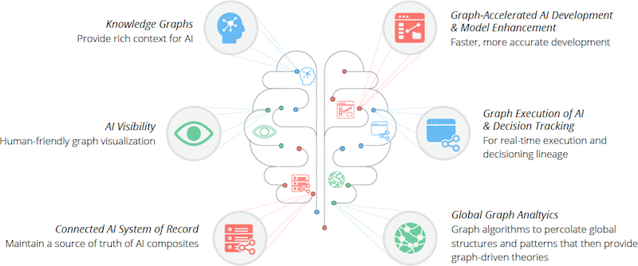

# Bootcamp 2021: Learn to Build AI and AIoT Serverless Multi-Tenant SaaS APIs in Baby Step

Covid-19 propelled businesses into the future, ready or not. “Covid has acted like a time machine: it brought 2030 to 2020,” said Loren Padelford, vice president at Shopify Inc. “All those trends, where organizations thought they had more time, got rapidly accelerated.” We at Panacloud are trying to respond to these challenges and trying to lead from the front.

### The Technologies which CEOs expect to Deliver Results for them over the Next Few Years

[The post-pandemic future of work - according to 3,000 CEOs from around the world](https://www.weforum.org/agenda/2021/02/the-post-pandemic-future-of-work-according-to-3-000-ceos-from-around-the-world-685436524a/)

### Graph-Based AI is the Future

[Graph-Based AI Enters the Enterprise Mainstream](https://www.informationweek.com/big-data/ai-machine-learning/graph-based-ai-enters-the-enterprise-mainstream/a/d-id/1340141)

### Bootcamp 2021 Coverage

Panacloud Bootcamp 2021 will fuse AI, IoT, and AWS Serverless Cloud Technologies. The Bootcamp will use Python, TypeScript and Rust as its development languages, TensorFlow as ML framework, AWS as its Serverless Cloud platform, AWS Graph Database Neptune and AWS Cloud Development Kit (CDK) with TypeScript for Infrastructure as Code.

### Those interested in web and mobile Serverless SaaS apps and APIs should also focus on [Bootcamp 2020](https://panacloud.github.io/bootcamp-2020/)

### Operation Unicorn Startups

[Operation Unicorn Facebook Group](https://www.facebook.com/groups/operation.unicorn/)

Bootcamp 2021 is preparing developers for Operation Unicorn Startups. More details for Operation Unicorn Startups will be announced latter.

### Introduction to English and Urdu Sections

[Join Panacloud Discord Discussion Server Now](https://discord.gg/kARFecfpAp)

### English Section:

Every Tuesday at 10:00 PM – 11:15 PM Pakistan Standard Time

Every Saturday at 10:00 PM – 11:15 PM Pakistan Standard Time

[English broadcast live on Facebook](https://www.facebook.com/groups/deep.learning.edu)

### Urdu Section:

Every Wednesday 10:00 pm to 11:15 pm Pakistan Standard Time

Every Sunday 10:00 pm to 11:15 pm Pakistan Standard Time

[Urdu broadcast live on Facebook](https://www.facebook.com/groups/deep.learning.edu)

### Teaching Team:

Inam ul Haq, Imran, Anees, [Zeeshan Hanif](https://github.com/zeeshanhanif), Faheem, Mateen, Daniyal Nogori, and [Zia Khan](https://github.com/ziaukhan).

## Prerequisites: Python, Rust and TypeScript

### Learn Python

[The Official Python Tutorial](https://docs.python.org/3/tutorial/index.html)

[Python Full Course - Learn Python in 12 Hours - Python Tutorial For Beginners](https://www.youtube.com/watch?v=WGJJIrtnfpk)

[Python Tutorial - Python for Beginners 2020](https://www.youtube.com/watch?v=kqtD5dpn9C8)

[Python Tutorial For Beginners - Python Full Course From Scratch - Python Programming - Edureka](https://www.youtube.com/watch?v=vaysJAMDaZw)

### Learn Rust

[The Official Rust Book](https://doc.rust-lang.org/book/)

[Intro to Rust](https://www.youtube.com/playlist?list=PLJbE2Yu2zumDF6BX6_RdPisRVHgzV02NW)

[Rust Projects](https://www.youtube.com/playlist?list=PLJbE2Yu2zumDF6BX6_RdPisRVHgzV02NW)

[Learn Rust - Tutorials, Courses, and Books](https://gitconnected.com/learn/rust)

### Learn TypeScript

[The TypeScript Handbook](https://www.typescriptlang.org/docs/handbook/intro.html)

[Programming TypeScript](https://www.amazon.com/Programming-TypeScript-Making-JavaScript-Applications/dp/1492037656/ref=sr_1_1)

[Learn from our Repo](https://github.com/panacloud-modern-global-apps/learn-typescript)

## Must Have: Create Free AWS Account

[AWS Free Tier](https://aws.amazon.com/free/)

Note: For AWS Free Tier you will need a credit or debit card. The easiest way for Pakistani students is to open a bank account in Meezan Bank. Open a Meezan Aasan Account if you have no earning proof. Meezan Bank will charge Rs. 1100 for ATM Debit Card and there is a requirement of Rs. 100 minimum deposit. The card will be delivered in a few weeks. Our students have reported that this Debit card works with AWS.

## Part 1: Introduction to Serverless using CDK

We will be writing Infrastructure as Code (IaC) CDK AWS Serverless constructs in TypeScript and Lambda Functions etc. in Python, TypeScript and Rust

Learning Material:

[Learning Serverless with CDK Repo](https://github.com/panacloud-modern-global-apps/full-stack-serverless-cdk)

## Part 2: Learning AWS Graph Database Neptune, Graph Data Modeling, Gremlin, Graphs, AI, and Machine Learning

### What is a Graph Database

[What is a graph database?](https://venturebeat.com/2021/02/08/what-is-a-graph-database/)

### The Future of Business, AI and IoT is Graph Databases

[Moving Toward Smarter Data: Graph Databases and Machine Learning](https://dzone.com/articles/graph-databases-machine-learning)

[Knowledge Graphs: Navigating the Future of AI, Interview with Charlie Beveridge of Accenture](https://neo4j.com/videos/knowledge-graphs-navigating-the-future-of-ai-interview-with-charlie-beveridge-of-accenture/)

[Graph-Based AI Enters the Enterprise Mainstream](https://www.informationweek.com/big-data/ai-machine-learning/graph-based-ai-enters-the-enterprise-mainstream/a/d-id/1340141)

[Why Experts See Graph Databases Headed for Mainstream Use](https://www.eweek.com/database/why-experts-see-graph-databases-headed-to-mainstream-use/)

[Why Graph Databases are Perfect for the Internet of Things](https://neo4j.com/blog/graph-databases-perfect-internet-things/)

[Using a Graph Database to Power the Internet of Things](https://vimeo.com/95437582)

[Graphs & The Internet of (Connected) Things](https://neo4j.com/blog/graph-of-things/)

[A combination of Internet of Things (IoT) and graph database for future battlefield systems](https://ieeexplore.ieee.org/document/8230010)

### We Select Amazon Neptune as our Graph Database

[Read the Graph Data Platforms Report](https://info.tigergraph.com/forrester-wave)

### Start Learning Neptune and Graph Databases

[Getting started with graph databases](https://docs.aws.amazon.com/neptune/latest/userguide/graph-get-started.html)

[Getting Started with Amazon Neptune - 7 Videos](https://pages.awscloud.com/AWS-Learning-Path-Getting-Started-with-Amazon-Neptune_2020_LP_0009-DAT.html)

[Lower the cost of building graph apps by up to 76% with Amazon Neptune T3 instances](https://aws.amazon.com/blogs/database/increasing-cost-effectiveness-up-to-76-with-amazon-neptune-t3-burstable-instances/)

### Start Learning Graph Data Modeling

[Graph data modeling: Chapter 2 of Graph Databases in Action](https://livebook.manning.com/book/graph-databases-in-action/chapter-2/)

### Start Learning Gremlin

[Gremlin Basics](https://docs.janusgraph.org/basics/gremlin/)

### Neptune with Lambda

[Using AWS Lambda functions in Amazon Neptune](https://docs.aws.amazon.com/neptune/latest/userguide/lambda-functions.html)

### Drawing Graphs with Neptune Data

[Let Me Graph That For You – Part 1 – Air Routes](https://aws.amazon.com/blogs/database/let-me-graph-that-for-you-part-1-air-routes/)

[Matplotlib Introduction](https://matplotlib.org/stable/tutorials/index.html#introductory)

[D3 Introduction](https://observablehq.com/@d3/learn-d3)

[mpld3 - Bringing Matplotlib to the Browser](https://mpld3.github.io/quickstart.html)

### Neptune ML and Graph AI

[Graph-Based AI Enters the Enterprise Mainstream](https://www.informationweek.com/big-data/ai-machine-learning/graph-based-ai-enters-the-enterprise-mainstream/a/d-id/1340141)

[How Graph Technology is Changing AI](https://databricks.com/session/how-graph-technology-is-changing-ai)

[How Graph Technology is Changing Artificial Intelligence and Machine Learning](https://neo4j.com/graphconnect-2018/session/graph-technology-ai-machine-learning)

[Amazon Neptune ML](https://aws.amazon.com/neptune/machine-learning/)

## Part 3: AI as a Service

[AI as a Service: Serverless machine learning with AWS](https://www.manning.com/books/ai-as-a-service)

## Part 4: Building Multi-Tenant SaaS APIs using Panacloud Serverless SaaS Tech

## Part 5: AIoT and Edge Computing 

[Getting started with AWS IoT Greengrass](https://docs.aws.amazon.com/greengrass/latest/developerguide/gg-gs.html)

[Getting started with AWS IoT Core](https://docs.aws.amazon.com/iot/latest/developerguide/iot-gs.html)

[Cloud Tutorial: AWS IoT](https://www.cse.wustl.edu/~lu/cse521s/Slides/aws-iot.pdf)

We will be using the Greengrass Tutorial and inhancing all the examples and code using CDK.

It is highly recommended that you have a Raspberry Pi 4 Model B, or Raspberry Pi 3 Model B/B+, with a 8 GB microSD card, or will have to use an Amazon EC2 instance as a virtual edge device.

## Part 6: Building, Training, and Deploying Machine Learning Models on Cloud and Edge with Amazon SageMaker

[Learn Amazon SageMaker: A guide to building, training, and deploying machine learning models for developers and data scientists](https://www.amazon.com/Learn-Amazon-SageMaker-developers-scientists/dp/180020891X)

[amazon-sagemaker-cdk-examples](https://github.com/aws-samples/amazon-sagemaker-cdk-examples)

We will be using the Learn Amazon SageMaker Textbook and inhancing all the examples and code using CDK.

## Part 7: Voice Computing

{Add Voice To Your Serverless Apps with Alexa Through AWS CDK](https://dev.to/cdkpatterns/add-voice-to-your-serverless-apps-with-alexa-through-aws-cdk-45n0)

## Part 8: Embedded Real-Time Computing

[FreeRTOS](https://aws.amazon.com/freertos/)

[The FreeRTOS™ Kernel](https://www.freertos.org/RTOS.html)

[A FreeRTOS API for embedded Rust](http://www.hashmismatch.net/libraries/freertos_rs/)

